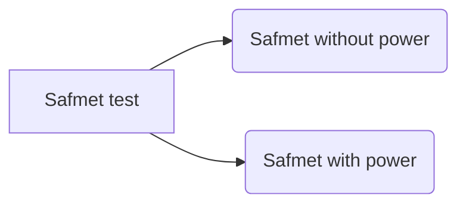

# Safmet
For any features modification only have to edit in "dev_id.h" file

1.for changing safmet UIDS make changes in below line:
byte dev_ID[4] = {0x00,0x00,0x11,0x58};   ///example if UID is 1158

2.For controlling vibration motor make changes in below line:
bool vib_motor = 1;//to ON vibration motor make it 1 and OFF vibration motor make it 0

3.For controlling buzzer make changes in below line:
bool buzz = 0;//to ON buzzer make it 1 and OFF buzzer make it 0

<<<<<<< HEAD
The following changes were made to the Safmet_V3.0.2 firmware :
Touch 3pin connector added(1-GND,2-TX(touch data pin,I/O),3-T_PWR(touch supply pin,VCC))
At USB Connector TX and T_PWR pin using for touch data and supply pin respectively.
At atmega328p ic pin PC3(ADC3)using for T_PWR.
Tilt sensor removed from schematic because for low battery led we required one gpio pin.
Q1 FDN360P MOSFET added across TPS (due to unavaibility of TPS we can use this mosfet.

The following changes were made to the Safmet_P3.0.2 hardware:
Q2 mosfet placed between battery and circuit.
Resistors value replaced -r13(4.7k), r20(1.5k), and r37(1.5k).
led added(LED,PC1/ADC1) for low battery status.
Touch 3pin connector added(1-GND,2-TX(touch data pin,I/O),3-T_PWR(touch supply pin,VCC))
At USB Connector TX and T_PWR pin using for touch data and supply pin respectively.
At atmega328p ic pin PC3(ADC3)using for T_PWR.
Tilt sensor removed from schematic because for low battery led we required one gpio pin.
Q1 FDN360P MOSFET added across TPS (due to unavaibility of TPS we can use this mosfet.

**Please reffer file inside document folders for more detailed information**
=======
Safmet_V4.1.1_Firmware modifications :(firmware not yet updated)
* Battery indication level added
* As per batery indication level the leds will glow as per battery voltage values

Safmet_P4.1.1_Hardware modifications :
* Battery indication level added
* As per batery indication level the leds will glow as per battery voltage values

Safmet_P4.1.2_Hardware_modifications:
* GPIO changes for battery level indication LEDs and touch sensor.
* 3 GPIOs allocated for the above purpose out of which 2 are for LEDs and 1 is for touch sensor. 
* 3 Battery level indicator LEDs are used.
* Routing changes are made for LEDs and touch sensor in the PCB.
* LED4, the last indicator LED is connected to the red LED from the charging IC, to indicate changing, not charging and full charge.

Safmet_P4.1.2_Firmware_changes:
* Battery voltage LED indicator code implemented.
* Touch sensor GPIO changed
* Power Bank LED indication commit contains LED orientation change, go back one v4.1.2 firmware update commit for the original code.
* The indicator LEDs also blink when interacting with CASnode.
* The last indicator LED (LED4) only glows while charging and turns off while not charging or fully charged. It is controlled by charging IC.
* Comment the #define DEBUG_FW412 in HSA.h file to disable indicator LED serial prints. This is for debugging purpose.
* Drive link for the logs: https://drive.google.com/drive/folders/186YdwHGtXs0Swo4dXXBLYpxf8oaPSQxR?usp=sharing

**Please reffer file inside document folders for more detailed information*
**

# Safmet Steps to be followed before Programming

Please follow the steps bellow 

## WITHOUT POWER
`'1'`  -->  Shorting between charging IC I/P and GND

`'2'`  --> Shorting between charging IC I/P and LDO I/P

`'3'`  --> Shorting between charging LDO O/P and GND

`'4'`  --> Shorting between charging LDO O/P and TPS I/P

`'5'`  --> Shorting between charging 3V3_AT_MEGA and GND

`'6'`  --> CHECK IF R16 IS POPULATED

## WITH POWER
`'1'`  Charging IC I/P Voltage -->> ~5V

`'2'`  Charging IC O/P Voltage -->> ~4.2V ~ 4.45V

`'3'`  LDO I/P Voltage -->> 3.3 ~ 4.45V

`'4'`  LDO O/P Voltage -->> ~3.3V

`'5'`  Atmega I/P voltage -->> 3.3V

`'6'`  DW1001 I/P Voltage -->> 3.3V

`'7'`  ATTINY I/P Voltage -->> 3.3V

>>>>>>> 14d3cf69e7ccf40287b20986273e0a98dfd82425
